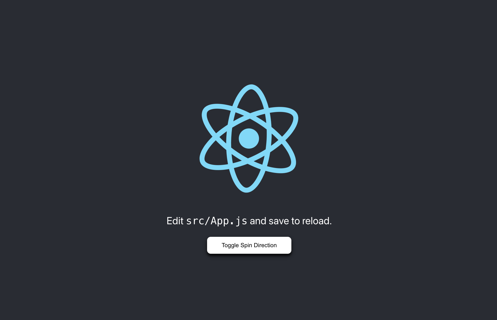
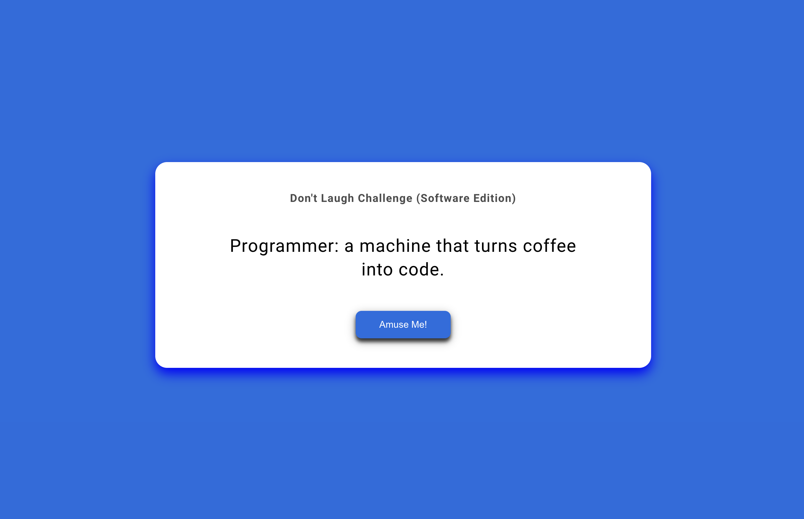

# Tutorial 2: Hands-on With Docker

## Objective

This tutorial and hands-on session aims to enable you to use Docker as an integral part of the development process for a Node.js web application. The focus is on providing the skills necessary to compile, run, and manage code with Docker containers, highlighting Docker's role as a versatile development toolbox that enhances workflow consistency and efficiency.

## Introduction

### Overview of Docker

Docker is an open platform for developing, shipping, and running applications.

Docker allows you to separate your applications from your infrastructure so you can deliver software quickly. With Docker, you can manage your infrastructure in the same ways you manage your applications.

By taking advantage of Docker’s methodologies for shipping, testing, and deploying code quickly, you can significantly reduce the delay between writing code and running it in production.

> Reference [Docker Docs](https://docs.docker.com/get-docker/)

### Overview of Node.js

Node.js is a powerful, open-source JavaScript runtime environment that enables developers to execute JavaScript code server-side. Renowned for its efficiency and scalability, Node.js operates on the V8 engine, allowing for high-speed execution of JavaScript outside the web browser.

It adopts an event-driven, non-blocking I/O model, making it particularly well-suited for building scalable network applications like web servers, real-time communication systems, and API services.

Node.js comes with npm, a vast package manager, enriching its ecosystem with a wide array of libraries and tools. This cross-platform environment is favored for its ability to handle concurrent requests efficiently, making it a popular choice for modern web development, especially in applications requiring real-time capabilities.

With a robust community, Node.js has become a staple in the technology stacks of many companies and developers worldwide.

> Reference [Node.js Website](https://nodejs.org/en/learn/getting-started/introduction-to-nodejs)

### Why Node.js and Docker

The objective of this tutorial is to empower you with the ability to integrate Docker effectively into the development process of a Node.js web application. Here's an overview of why Docker and Node.js are pivotal in this hands-on session:

**Enhancing Development and Workflow Consistency:** Docker's role as a containerization platform is critical in establishing a consistent, efficient workflow. By focusing on Docker, you learn to compile, run, and manage Node.js code with containers, ensuring that the development environment is replicable and consistent across any platform.

**Practical Application in Course Projects:** While not mandatory, the skills acquired in this session can greatly benefit you in the course-related projects and assignments, especially if they choose to utilize Node.js and Docker.

**Leveraging Seamless Integration with Development Tools:** Docker's compatibility with a range of development tools, like Nodemon for Node.js, exemplifies its role in streamlining the development process. These tools automate and simplify tasks, enhancing the overall efficiency of developing, testing, and debugging Node.js applications.

**Benefiting from Vast Community Support:** Both Docker and Node.js are supported by robust online communities. This vast network offers an abundance of resources, guidance, and shared knowledge, which you can leverage for troubleshooting, learning best practices, and keeping up-to-date with the latest advancements in web development.

> Generated with the help of ChatGPT

## Getting Ready

Ensure that you have Docker set up and running in your system.

Here are some common terminologies used in Docker that you should familiarise yourselves with:

| Term             | Description                                                                                                                                                             |
| ---------------- | ----------------------------------------------------------------------------------------------------------------------------------------------------------------------- |
| Docker Daemon    | Listens to Docker API requests. Manages Docker objects - images, containers, networks and volumes. It can also communicate with other daemons.                          |
| Docker Image     | Read-only templates used to create Docker containers. You can create your own image or use pre-existing ones.                                                           |
| Docker Container | A runnable instance of an image. You can create, start, stop, move, or delete a container using the Docker API or CLI.                                                  |
| Docker Registry  | A repository for Docker images. Docker Hub is the default registry. Using `docker pull` or `docker run` commands uses the required images from the configured registry. |
| Docker Client    | The primary way users interact with Docker. It sends commands to the Docker Daemon. It can communicate with >1 daemon.                                                  |
| Docker Desktop   | A GUI tool that includes the Docker Daemon, Client, Docker Compose, Content Trust, Kubernetes, etc.                                                                     |
| Docker Objects   | Images, containers, networks, volumes, plugins, etc.                                                                                                                    |

## Dockerfile

### What is a Dockerfile?

- A Dockerfile is a text document containing a set of instructions to build a Docker image.
- Docker images form the basis of containers, which are isolated environments running your application.

### Key Instructions

| Instruction  | Usage                                                                                                                                                                             |
| ------------ | --------------------------------------------------------------------------------------------------------------------------------------------------------------------------------- |
| FROM         | Specifies the base image to start building your image. For example, `FROM ubuntu:18.04` starts with the Ubuntu 18.04 image.                                                       |
| RUN          | Executes a command and commits the results. Used for installing software packages, for example.                                                                                   |
| COPY and ADD | Both are used to copy files from the host filesystem to the container. `COPY` is straightforward, while `ADD` has some extra features like remote URL support and tar extraction. |
| CMD          | Provides a command and its default arguments that will be executed when the container starts. Only the last `CMD` instruction is effective.                                       |
| ENTRYPOINT   | Similar to `CMD`, but is meant to define the container's main executable and its arguments are appended to the entrypoint.                                                        |
| ENV          | Sets environment variables.                                                                                                                                                       |
| EXPOSE       | Indicates which ports the container listens on.                                                                                                                                   |
| WORKDIR      | Sets the working directory for any `RUN`, `CMD`, `ENTRYPOINT`, `COPY`, and `ADD` instructions.                                                                                    |

> A part of this table was generated with the help of ChatGPT

### Basic Structure

- A Dockerfile comprises a set of instructions, like `FROM`, `RUN`, `COPY`, `ENTRYPOINT`, etc.
- Each instruction creates a layer in the Docker image.

### Sample Dockerfile

- File naming convention: `Dockerfile`

```
# Use an official Node.js runtime as a parent image
FROM node:20-alpine

# Set the working directory in the container
WORKDIR /app

# Copy package.json and package-lock.json
COPY package*.json ./

# Install any dependencies
RUN npm install

# Bundle app source inside the Docker image
COPY . .

# Make port 3000 available to the world outside this container
EXPOSE 3000

# Define the command to run your app
CMD ["node", "app.js"]
```

### Best Practices

- Use specific versions of Node.js in your `FROM` statement.
- Minimize layer size: Group instructions like RUN to reduce the number of layers.
- Use `.dockerignore` to avoid copying unnecessary files into your Docker image.

## Docker Commands

- `docker run`

  - Purpose: Starts a new container from an image.
  - Common Flags:
    - `-d`: Run container in detached mode (in the background).
    - `--name [name]`: Assign a name to the container.
    - `-p [host port]:[container port]`: Map a host port to a container port.
    - `-v [host directory]:[container directory]`: Mount a volume.
  - Example: `docker run -d --name my-app -p 3000:3000 my-node-app`
  - Explanation: This command runs my-node-app in detached mode, names it my-app, and maps port 3000 on the host to port 3000 on the container.

- `docker ps`

  - Purpose: Lists running containers.
  - Common Flags:
    - `-a`: Show all containers (default shows just running).
  - Example: `docker ps -a`
  - Explanation: This lists all containers, including those that are not running.

- `docker images`

  - Purpose: List images.
  - Common Flags:
    - `-a`: Show all images (default hides intermediate images).
    - `--format "{{.ID}}: {{.Repository}}"`: Custom format for listing.
  - Example: `docker images --format "{{.ID}}: {{.Repository}}"`
  - Explanation: Lists all Docker images with a custom format showing their ID and repository.

- `docker pull`

  - Purpose: Pulls an image from a registry.
  - No major flags commonly used.
  - Example: `docker pull node`
  - Explanation: Pulls the latest Node.js image from Docker Hub.

- `docker build`

  - Purpose: Build an image from a Dockerfile.
  - Common Flags:
    - `-t [name]:[tag]`: Name and optionally a tag in the ‘name:tag’ format.
    - `--file [Dockerfile path]`: Specify the location of the Dockerfile.
  - Example: `docker build -t my-node-app:1.0 .`
  - Explanation: Builds an image from a Dockerfile in the current directory, tagging it as my-node-app:1.0.

- `docker exec`

  - Purpose: Execute a command in a running container.
  - Common Flags:
    - `-it`: Interactive terminal.
    - `--user [username]`: Specify the username to use inside the container.
  - Example: `docker exec -it mynginx /bin/bash`
  - Explanation: Opens an interactive bash shell inside the mynginx container.

- `docker stop`

  - Purpose: Stop one or more running containers.
  - No major flags commonly used.
  - Example: `docker stop my-app`
  - Explanation: Stops the container named my-app.

- `docker rm`

  - Purpose: Remove one or more containers.
  - Common Flags:
    - `-f`: Force the removal of a running container.
  - Example: `docker rm my-app`
  - Explanation: Removes the container named my-app.

- `docker rmi`

  - Purpose: Remove one or more images.
  - Common Flags:
    - `-f`: Force removal of the image.
  - Example: `docker rmi my-node-app:1.0`
  - Explanation: Removes the image my-node-app:1.0.

- `docker logs`

  - Purpose: Fetch the logs of a container.
  - Common Flags:
    - `--follow`: Follow log output.
    - `--tail [number]`: Number of lines to show from the end of the logs.
    - Example: `docker logs --tail 100 my-app`
    - Explanation: Displays the last 100 lines of the log for the my-app container.

- `docker network create`

  - Purpose: Create a network.
  - Common Flags:
    - `--driver`: Specify network driver (e.g., bridge, overlay).
  - Example: `docker network create --driver bridge my_bridge_network`
  - Explanation: Creates a new network called my_bridge_network using the bridge driver.

- `docker volume create`

  - Purpose: Create a volume.
  - No major flags commonly used.
  - Example: `docker volume create my_volume`
  - Explanation: Creates a new volume named my_volume.

## Node.js Application

### Getting Ready

- Download or Clone the source code from [GitHub](https://github.com/Jai2501/Tutorial2)
- Open a command line/terminal window and navigate into the source code folder (`Tutorial2/demo-app`).

### The Dockerfile

The Dockerfile is currently empty. The aim of this hands-on is to teach you how to write a Dockerfile.

1. As we are interested to build a Node.js Application using React, we need to have a runtime environment that has our desired version of Node.js installed. Thus, we would use the official Node image as a parent image to acheieve our objective.

Add the following line to the Dockerfile:

```
FROM node:20-alpine
```

2. Next, we specify the working directory in the container.

Add the following line to the Dockerfile:

```
WORKDIR /app
```

3. In the case of Node.js applications, we need to copy the `package.json` and `package-lock.json` (or `yarn.lock`) files as these include the relevant dependencies of our app. Node.js relies on these files to lookup and install the dependencies.

Add the following line to the Dockerfile:

```
COPY package*.json ./
```

4. After the files have been copied, the relevant dependencies have to be installed, and on using the command `npm install`, the required node modules (dependencies) are installed.

Add the following line to the Dockerfile:

```
RUN npm install
```

5. After all dependencies have been installed, we copy the entire source code directory into the working directory of the container and this includes all of the relevant code.

Add the following line to the Dockerfile:

```
COPY . .
```

6. Next, we want to be able to interact with our app and as React based apps by default start on port 3000, we expose that port. This allows the outside world to interact with the created container and our app using port 3000.

Add the following line to the Dockerfile:

```
EXPOSE 3000
```

7. Now that all is set up, we want to start our app. For starting React based apps, the command used is `npm start`, and hence that is what we add as a command next.

Add the following line to the Dockerfile:

```
CMD ["npm", "start"]
```

Finally, the created Dockerfile should look like this:

```
FROM node:20-alpine

WORKDIR /app

COPY package*.json ./

RUN npm install

COPY . .

EXPOSE 3000

CMD ["npm", "start"]
```

### Building the Image

Now that the Dockerfile is setup, we have a skeleton for the image of our app.

Using the `docker build` command, we will now create an image of our app.

1. Open a command line/terminal window and navigate to the downloaded/cloned repo, and then into the `demo-app` directory where the Dockerfile is located.

2. Run the following command:

```
docker build -t tic3001-demo-app .
```

- Above, the `-t` flag tags the create image with `tic3001-demo-app`.
- `.` refers to look for the Dockerfile in the Current Working Directory (CWD)

### Running the Container

With the Image ready, we can run our React app using Docker.

1. In the same command line/terminal window, run the following command:

```
docker run --name my-app -p 3000:3000 -d tic3001-demo-app
```

- Above, the flag `-p` allows to bind our systems port 3000 to the port 3000 of container.

- The flag `-d` allows to run the Docker Container in detached mode.

2. Open your browser of choice and go to http://localhost:3000/ to interact with the React App.

3. The running container can be stopped using the command:

```
docker stop my-app
```

### Binding the Current Working Directory

Binding the Current Working Directory with the Docker Container allows you to edit your code on your local system and see the changes in the app in real-time that is running on the Docker Container.

1. In the same command line/terminal window, run the following command:

macOS users:

```
docker run --name my-app -p 3000:3000 -v $(pwd):/app -d tic3001-demo-app
```

Windows Command Line users:

```
docker run --name my-app -p 3000:3000 -v %cd%:/app -d tic3001-demo-app
```

Windows Powershell users:

```
docker run --name my-app -p 3000:3000 -v ${PWD}:/app -d tic3001-demo-app
```

- The flag `-v` allows to mount the Current Working Directory as a volunme in the Docker Container.

2. Go to `src/App.js` and add the following code inside the `function App()`:

```
function toggleAnimation() {
  var logo = document.querySelector(".App-logo-clockwise");
  var isLogoRotatingClockwise = logo !== null;

  if (isLogoRotatingClockwise) {
    logo.classList.remove("App-logo-clockwise");
    logo.classList.add("App-logo-anti-clockwise");
  } else {
    logo = document.querySelector(".App-logo-anti-clockwise");

    logo.classList.remove("App-logo-anti-clockwise");
    logo.classList.add("App-logo-clockwise");
  }
}
```

3. In the same file, add the following code inside the `<header>` tag, right after the `<p>` tag

```
<button className="spin-btn" onClick={() => toggleAnimation()}>
  Toggle Spin Direction
</button>
```

4. Press `CTRL/CMD + S`

5. You should now be able to see a button that says "Toggle Spin Direction", which on clicking will change the spin direction of the React logo.



6. The running container can be stopped using the command:

```
docker stop my-app
```

> Note: If you do not bind volumes, such changes can not be seen in real-time, and the containers have to be stopped and run again, making the process tedious. Please refer to the section on [Binding the Current Working Directory](#binding-the-current-working-directory)

### Exercise

1. Create a Dockerfile for demo-service based on the following inputs:

- Parent image is `node:20-alpine`
- Working directory as `/app`
- Service Port Number `3001`
- Command to run service: `npm start`

2. Build and Run the container.

3. Go to `http://localhost:3001/` and you should see the following output:


## Docker Compose

### Overview of Docker Compose

Docker Compose is a tool for defining and running multi-container Docker applications. With Compose, you use a YAML file to configure your application’s services, which simplifies the process of managing and deploying multi-container applications.

> Generated with the help of ChatGPT

### Key Concepts

- **Services**: These are the containers in your application.
- **Networks**: Define how the Docker daemon should handle networking between containers.
- **Volumes**: Persistent data storage for your Docker containers.
- **Build and Image Configuration**: How to build the Docker images for your services.

> Generated with the help of ChatGPT

### Sample Docker Compose file

- File naming convention: `docker-compose.yml`

```
version: '3.8'  # specifies the Docker Compose file version

services:
  web:  # the name of the first service
    image: nginx:latest  # uses the latest Nginx image
    ports:
      - "80:80"  # maps port 80 of the container to port 80 on the host
    volumes:
      - ./html:/usr/share/nginx/html  # mounts the 'html' directory from the host to the container
    networks:
      - webnet  # links this service to the network named 'webnet'

  db:  # the name of the second service
    image: postgres:latest  # uses the latest PostgreSQL image
    environment:
      POSTGRES_DB: mydatabase  # sets the PostgreSQL database name
      POSTGRES_USER: user  # sets the PostgreSQL user
      POSTGRES_PASSWORD: password  # sets the PostgreSQL password
    volumes:
      - db-data:/var/lib/postgresql/data  # mounts the 'db-data' volume to the container
    networks:
      - webnet  # links this service to the network named 'webnet'

volumes:
  db-data:  # declares a volume named 'db-data' for persistent data storage

networks:
  webnet:  # declares a user-defined network named 'webnet'

```

### Docker Compose Commands

- `docker-compose up`

  - Purpose: Builds, (re)creates, starts, and attaches to containers for a service.
  - Common Flags:
    - `-d`: Detached mode: Run containers in the background.
    - `--build`: Build images before starting containers.
    - `--no-deps`: Don't start linked services.
    - `--force-recreate`: Recreate containers even if their configuration and image haven't changed.
  - Example: `docker-compose up -d`
  - Explanation: This command starts the containers in detached mode as defined in the docker-compose.yml file.

- `docker-compose down`

  - Purpose: Stops containers and removes containers, networks, volumes, and images created by up.
  - Common Flags:
    - `--volumes` or `-v`: Remove named volumes declared in the volumes section of the Compose file and anonymous volumes attached to containers.
    - `--rmi type`: Remove images, type may be all or local.
  - Example: `docker-compose down --volumes`
  - Explanation: Stops the containers and removes the containers along with the volumes.

- `docker-compose build`

  - Purpose: Builds or rebuilds services.
  - Common Flags:
    - `--no-cache`: Do not use cache when building the image.
    - `--parallel`: Build images in parallel.
  - Example: `docker-compose build --no-cache`
  - Explanation: Builds the service images without using the cache.

- `docker-compose logs`

  - Purpose: View output from containers.
  - Common Flags:
    - `--follow` or `-f`: Follow log output.
    - `--tail="number"`: Number of lines to show from the end of the logs for each container.
  - Example: `docker-compose logs -f`
  - Explanation: Follows the log output of all containers.

- `docker-compose ps`

  - Purpose: Lists containers.
  - Common Flags:
    - `--services`: Display services.
    - `--all` or `-a`: Show all stopped containers.
  - Example: `docker-compose ps`
  - Explanation: Lists the containers related to the images declared in the docker-compose.yml file.

- `docker-compose restart`

  - Purpose: Restarts all stopped and running services.
  - Common Flags:
    - `-t` or `--timeout`: Specify a shutdown timeout in seconds (default is 10).
  - Example: `docker-compose restart`
  - Explanation: Restarts all currently running services.

- `docker-compose stop`

  - Purpose: Stops running containers without removing them.
  - Common Flags:
    - `-t` or `--timeout`: Specify a shutdown timeout in seconds.
  - Example: `docker-compose stop`
  - Explanation: Stops all running services defined in the docker-compose.yml file.

- `docker-compose start`

  - Purpose: Starts existing containers for a service.
  - No major flags commonly used.
  - Example: `docker-compose start`
  - Explanation: Starts all stopped services defined in the docker-compose.yml file.

- `docker-compose exec`

  - Purpose: Executes a command in a running container.
  - Common Flags:
    - `-d`: Detached mode: Run command in the background.
    - `--user [USER]`: Run the command as this user.
  - Example: `docker-compose exec -d myservice /bin/bash`
  - Explanation: Executes a bash shell in the myservice container in detached mode.

- `docker-compose rm`
  - Purpose: Removes stopped service containers.
  - Common Flags:
    - `-f` or `--force`: Don't ask to confirm removal.
    - `-v`: Remove any anonymous volumes attached to containers.
  - Example: `docker-compose rm -f`
  - Explanation: Force removes all stopped containers defined in the docker-compose.yml file.

## Node.js Application

### The docker-compose.yml file

The docker-compose.yml file is created in the root of your project. This file defines how Docker containers should behave when ran together.

```
# Specify the version of the Docker Compose.
version: "3.9"

# Define the services and applications that make up your application.
services:
  demo-app:
    build: ./demo-app # Path to the directory containing the Dockerfile for building the demo-app image.
    ports:
      - 3000:3000 # Maps port 3000 on the host to port 3000 in the container, making the app accessible on the host.
    volumes:
      - ./demo-app:/app # Mounts the host directory './demo-app' to '/app' in the container.
      - /app/node_modules # Anonymous Volume
    networks:
      - demo-network # Connects the demo-app to the 'demo-network' network.

  demo-service:
    build: ./demo-service # Path to the directory containing the Dockerfile for the demo-service.
    ports:
      - 3001:3001 # Maps port 3001 on the host to port 3001 in the container.
    volumes:
      - ./demo-service:/app # Mounts the host directory './demo-service' to '/app' in the container.
      - /app/node_modules # Anonymous Volume
    networks:
      - demo-network # Connects the demo-service to the 'demo-network' network.

networks:
  demo-network: # Defines a network named 'demo-network'.
    driver: bridge # Uses the bridge driver for the network, which is the default and most common network type in Docker.
```

### Building the Images

Using the following command, all the services (and networks, volumes) are built, without requiring to invoke and run commands one by one:

```
docker-compose build --no-cache
```

- Above, the flag `--no-cache` forces docker to rebuild all images from scratch.

### Running the Containers

Using the following command, all the containers specified in the docker-compose file are ran:

```
docker-compose up -d
```

- Above, the flag `-d` runs all containers in detached mode.

### Exercise

1. Edit the `docker-compose.yml` file and add demo-service as a `sevice` in the file.

2. Build and Run the containers using `docker-compose` commands.

3. Go to `http://localhost:3000/jokes` and you should see the following output:



4. Feel free to add and edit code to see changes happen in real-time.

## Conclusion

As we conclude this tutorial, it's clear that integrating Docker into the Node.js development process brings substantial benefits, streamlining and refining how we build, run, and manage applications. Key highlights include:

- **Resolving "Runs on My Machine" Dilemma**: Docker stands out in its ability to eliminate the all-too-common "runs on my machine" issue. By containerizing the Node.js environment, Docker ensures consistent behavior across different development and production settings, thereby promoting reliability and reducing environment-specific bugs.

- **Streamlined Dependency Management**: A major advantage of using Docker is the abstraction of dependency management. Containers come pre-packed with all necessary dependencies, obviating the need for individual installations. This not only simplifies the setup but also avoids conflicts arising from mismatched dependency versions.

- **Immediate Project Ramp-Up**: Docker's containerization allows developers to bypass the time-consuming setup process traditionally associated with development environments. With everything encapsulated in a container, starting a new project or joining an existing one becomes a quick and straightforward process.

- **Simplified Collaboration and Distribution**: Sharing a project is as simple as sharing its Dockerfile and docker-compose file. This ease of distribution ensures that team members can replicate the exact development environment effortlessly, paving the way for seamless collaboration and consistency across teams.

> Generated with the help of ChatGPT

## Where to go from here?

You may learn more about the following with plenty of resources available all over the internet:

- Efficient Image Building
- Resource Management
- Security Practices

## References

- [Docker Docs](https://docs.docker.com/)
- [Node.js](https://nodejs.org/en/learn/getting-started/introduction-to-nodejs)
- [React](https://react.dev/learn)
- [ChatGPT](https://chat.openai.com/)
- [Stackoverflow](https://stackoverflow.com/)
- [W3Schools](https://www.w3schools.com/)
